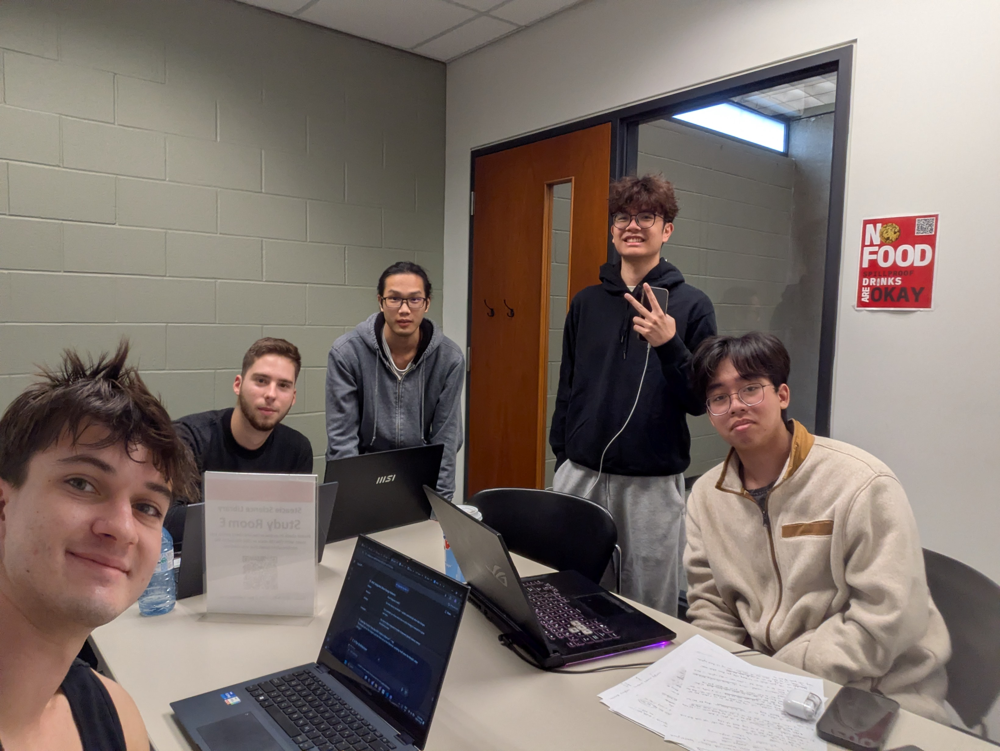

# Release Planning Meeting (RPM.md)

**Date:** October 2025  
**Sprint:** 1  
**Duration:** 1 hour  
**Attendees:**
- Ethan Constantin 
- Jason Hu 
- Nathan Benayguev 
- Pham Duc
- Kyle Fernandez

---

## 1. Meeting Overview

The Release Planning Meeting defined the **scope and deliverables** for Sprint 1 of YUEvents.  
This sprint focuses on **building and documenting separate, working layers** of the system, backend, frontend, and database, so that each component is ready for integration in Sprint 2.

---

## 2. Release Goals

**Primary Goal:**  
Establish a stable **frontend**, **backend**, and **database foundation**, each verified to run independently.

**Objectives:**
- Implement **FastAPI backend** with working user and event endpoints.
- Implement **Next.js frontend** pages for login, signup, and event feed (mock data or local JSON).
- Instantiate and migrate a **PostgreSQL database** with `User` and `Event` tables.
- Deliver documentation and a short demo showing both layers running separately.
- Prepare the groundwork for full integration in Sprint 2.

---

## 3. Planned User Stories / Tasks (from Trello)

| ID | User Story / Task | Description | Owner |
|----|--------------------|--------------|--------|
| 1 | **Event Feed** | Display mock event data in feed view | Frontend (Ethan, Jason) |
| 2 | **Implement Home Page** | Basic navigation and layout | Frontend |
| 3 | **Implement Login Page** | Local auth mock (to be integrated later) | Frontend |
| 4 | **Implement Signup Page** | Local form handling only | Frontend |
| 5 | **Implement User Entity** | Backend `User` model | Backend |
| 6 | **Implement Event Controller** | Backend endpoints `/api/events` | Backend |
| 7 | **Implement User Controller** | Backend endpoints `/api/users` | Backend |
| 8 | **Instantiate PostgreSQL DB** | Configure ORM and migrations | Backend / Database |
| 9 | **Documentation (Frontend & Backend)** | Create setup and API docs | All |
| 10 | **System Design Document** | Complete architecture doc | Nathan |
| 11 | **Features Demo Recording** | Show each layer working independently | All |

---

## 4. Team Discussion Summary

- **Architecture:** Confirmed a three-layer structure (Frontend, Backend, Database).  
  Layers will remain **decoupled in Sprint 1**, integrated later via REST API.
- **Frontend:** Focus on building functional pages with mocked API responses.  
- **Backend:** Focus on defining REST endpoints and testing DB operations with Postgres.  
- **Database:** Verified migrations and table creation scripts.  
- **Documentation:** Each layer must include clear setup instructions and test screenshots.  

---

## 5. Deliverables for Release 1

- ✅ Working **FastAPI backend** (runs independently with Postgres DB)  
- ✅ Functional **Next.js frontend** with mock data  
- ✅ PostgreSQL database instantiated with migrations  
- ✅ System Design Document (`YUEvents_System_Design_Sprint1.md`)  
- ✅ Demo recording showing backend and frontend running separately  

---

## 6. References

- **Trello Board:** (insert Trello link)  
  Example tasks: `Event feed`, `Features demo recording`, `System design doc`, `Documentation frontend and backend`, `Instantiate PostgreSQL DB`, `Implement home page`, `Implement user entity`, `Implement login page`, `Implement signup page`, `Event controller`, `User controller`.

---
## 7. Meeting recorded

