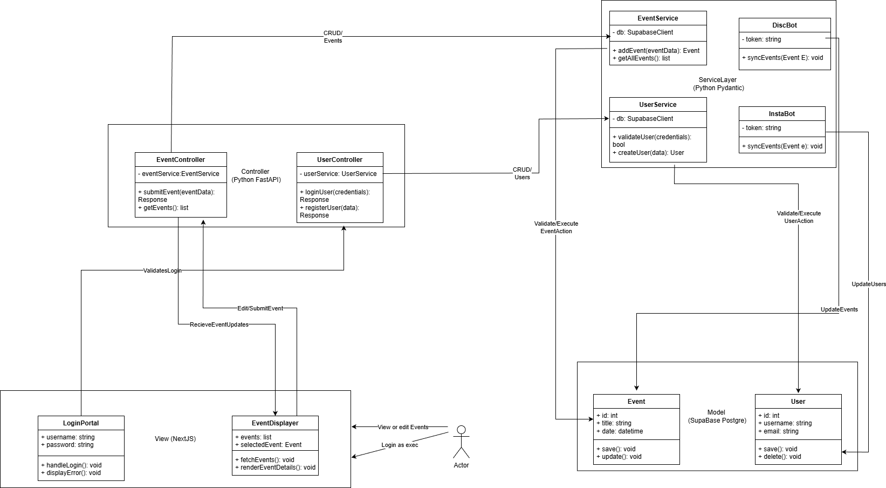

# YUEvents — System Design Document (Sprint 1)

**Location:** `doc/sprint1/YUEvents_System_Design_Sprint1.md`  
**Format:** Markdown (can be exported to PDF / MS-Word / HTML)  
**Version:** 1.0  
**Date:** October 2025  
**Team Members:**

- Ethan Constantin
- Jason Hu
- Nathan Benayguev
- Pham Duc
- Kyle Fernandez

---

## Table of Contents

1. [Overview](#overview)
2. [High-Level Goals for Sprint 1](#high-level-goals-for-sprint-1)
3. [System Context and Environment](#system-context-and-environment)
4. [Architecture (Diagram)](#architecture-abstract-view)
5. [System Decomposition and Component Roles](#system-decomposition-and-component-roles)
6. [CRC Cards (Class-Level Summary)](#crc-cards-class-level-summary)
7. [Data Models (Example Fields)](#data-models-example-fields)
8. [API Surface (Selected Endpoints)](#api-surface-selected-endpoints)
9. [Error & Exception Strategy](#error--exception-strategy)
10. [Security Considerations](#security-considerations)
11. [UI / UX Notes (Sprint 1 Minimal Set)](#ui--ux-notes-sprint-1-minimal-set)
12. [Acceptance Criteria Mapping (Sprint 1 Focus)](#acceptance-criteria-mapping-sprint-1-focus)
13. [Implementation Plan & Milestones (Sprint 1)](#implementation-plan--milestones-sprint-1)
14. [Risks & Mitigations](#risks--mitigations)
15. [Appendix: Example Repository Layout](#appendix-example-repository-layout)

---

## 1. Overview

[YUEvents System Design Diagram](https://apps.nulab.com/i/1bvwmIYyn3d5w8YydF3R1K2R8KjmnZvd)

YUEvents is a web application that aggregates university and club events (scraped from sources such as YuConnect, Discord, and Instagram) and provides a single feed, search, calendar views, and club-exec posting tools.

Sprint 1 focuses on the initial foundation so that model-view-controller connectivity is demonstrated (e.g., creating an Event in the database via the frontend).

**Tech Stack (Project Baseline):**

- **Frontend:** Next.js
- **Backend:** Python + FastAPI
- **Database:** PostgreSQL (or MySQL alternative)
- **Scraper:** BeautifulSoup (+ Discord bot / Instagram scraping where permitted)
- **Auth:** JWT-based session and role management (student, exec, admin)

---

## 2. High-Level Goals for Sprint 1

- Implement `Event` model and API endpoints for create/read/list events.
- Build basic Next.js pages: event feed list, event details, and a minimal admin/exec event posting form.
- Establish DB connectivity and migrations to store Events and Clubs.
- Demonstrate frontend form submission creating a persisted DB event visible in the feed.

---

## 3. System Context and Environment

**Assumptions & Dependencies**

- Target OS: Linux (Ubuntu) for deployment; development supported on macOS/Windows.
- Python 3.11+ (FastAPI + Uvicorn) and Node 18+ for Next.js.
- PostgreSQL 13+ recommended; MySQL 8+ supported with minimal changes.
- Dev tools: Docker (optional) for local development; Alembic for migrations.
- External services (Sprint 1 limited): scrapers run locally as scripts.
- Later integration (Discord API, Instagram scraping, YuConnect API) will require tokens and rate-limit handling.

**Network & Infrastructure**

- Backend exposes REST API: `/api/events`, `/api/auth`, `/api/clubs`.
- Frontend communicates via same-origin or configured CORS for development.
- JWT stored in secure HttpOnly cookie (preferred) or localStorage.

---

## 4. Architecture (Abstract View)

We follow a **three-tier architecture**:

- **Presentation Layer (Frontend):** Next.js pages, components, client-side API calls to backend. Handles UI, infinite-scroll feed, search.
- **Application Layer (Backend/API):** FastAPI app exposing REST endpoints, implementing business logic, authentication, input validation, and authorization.
- **Data Layer:** PostgreSQL database, migration scripts, ORM models (SQLModel or SQLAlchemy).
- **Scraper / Aggregator:** Independent worker scripts (BeautifulSoup) or microservices posting validated JSON to backend endpoints.

### Component Diagram (3 Layer Architecture)



## 5. System Decomposition and Component Roles

This section maps each architectural component to its corresponding code modules and responsibilities.

### Frontend (`frontend/`)

- **pages/** — `/`, `/events/[id]`, `/create`, `/admin`
- **components/** — `Feed`, `EventCard`, `EventForm`, `SearchBar`
- **lib/api.ts** — lightweight client wrappers for backend API calls

### Backend (`backend/fastapi_app/`)

- **main.py** — app and route registration
- **routers/events.py** — endpoints for list, get, create, edit, delete
- **routers/auth.py** — handles registration/login and role middleware
- **models/** — ORM models: `Event`, `Club`, `User`, `Tag`
- **services/duplicate_detection.py** — simple duplicate heuristics
- **scrapers/receiver.py** — endpoint for scrapers to POST event data
- **workers/** — optional background tasks (e.g., email, analytics)

### Database

- **Tables:** users, clubs, events, tags, event_tags, rsvps, comments (future sprints)

### Scraper Scripts

- `scrapers/yuconnect_scraper.py`
- `scrapers/discord_bot.py` _(requires token/permissions)_
- `scrapers/instagram_scraper.py` _(rate-limited)_

---

## 6. CRC Cards (Class-Level Summary)

### Class Name: User

**Responsibilities:**

- Represent a platform user (student, exec, or admin)
- Store credentials and profile data
- Link to events created or attended
- Support role-based permissions

**Collaborators:**  
`UserRepo`, `UserService`, `UserController`

---

### Class Name: UserRepo

**Responsibilities:**

- Handle CRUD operations for users
- Query users by email, ID, or role
- Manage persistence with SQLModel or SQLAlchemy

**Collaborators:**  
`User`, `UserService`, `UserController`

---

### Class Name: UserController

**Responsibilities:**

- Expose HTTP endpoints for user management & auth
  - POST `/login`, `/register`, `/logout`
  - GET `/users/me`, `/users/{id}`, PUT `/users/me`
- Handle validation, authorization, and JWT return

**Collaborators:**  
`UserService`, `UserRepo`, `User`

---

### Class Name: UserService

**Responsibilities:**

- Validate credentials, register users, hash passwords
- Manage JWT creation and permissions
- Bridge between controller and repo layers

**Collaborators:**  
`UserRepo`, `UserController`, `User`

---

### Class Name: Event

**Responsibilities:**

- Represent an event (title, description, date, location, organizer)
- Store relationships (club, tags, attendees)
- Used for scraped and manually added events

**Collaborators:**  
`EventRepo`, `EventService`, `EventController`

---

### Class Name: EventRepo

**Responsibilities:**

- Manage CRUD operations for events
- Query by date, tag, or organizer
- Prevent duplicates

**Collaborators:**  
`Event`, `EventService`, `EventController`

---

### Class Name: EventService

**Responsibilities:**

- Validate and manage event creation, update, and deletion
- Handle search, filtering, tagging
- Integrate with scrapers

**Collaborators:**  
`EventRepo`, `EventController`, `Event`

---

### Class Name: EventController

**Responsibilities:**

- CRUD API:
  - POST `/events`, GET `/events/{id}`, PUT `/events/{id}`, DELETE `/events/{id}`
- Enforce permissions and coordinate validation

**Collaborators:**  
`EventService`, `EventRepo`, `UserController`, `Event`

---

## 7. Data Models (Example Fields)

### Event

| Field                   | Type         | Description                                      |
| ----------------------- | ------------ | ------------------------------------------------ |
| id                      | UUID         | Unique event ID                                  |
| title                   | string       | Event title                                      |
| description             | text         | Description                                      |
| start_time / end_time   | timestamp    | Date & time                                      |
| location                | string       | Location or geo                                  |
| club_id                 | FK           | Organizer club                                   |
| source                  | enum         | manual / scraper-yuconnect / discord / instagram |
| orig_url                | string       | Source link                                      |
| tags                    | many-to-many | Event tags                                       |
| created_by              | user_id      | Creator                                          |
| created_at / updated_at | timestamp    | Record metadata                                  |

### Club

| Field         | Type   |
| ------------- | ------ |
| id            | UUID   |
| name          | string |
| description   | text   |
| socials       | JSON   |
| contact_email | string |

### User

| Field         | Type                       |
| ------------- | -------------------------- |
| id            | UUID                       |
| name          | string                     |
| email         | string                     |
| password_hash | string                     |
| role          | enum(student, exec, admin) |

---

---

## 8. API Surface (Sprint 1 Endpoints)

The backend exposes RESTful endpoints organized by resource type: **Users**, **Clubs**, and **Events**.  
Each category supports full CRUD operations (Create, Read, Update, Delete).

| Category   | Method | Endpoint           | Description                          |
| ---------- | ------ | ------------------ | ------------------------------------ |
| **Users**  | POST   | `/api/users`       | Create new user (registration)       |
|            | GET    | `/api/users`       | Get all users                        |
|            | GET    | `/api/users/{id}`  | Get user by ID                       |
|            | PUT    | `/api/users/{id}`  | Update existing user                 |
|            | DELETE | `/api/users/{id}`  | Delete user account                  |
| **Clubs**  | POST   | `/api/clubs`       | Create new club                      |
|            | GET    | `/api/clubs`       | Get all clubs                        |
|            | GET    | `/api/clubs/{id}`  | Get club by ID                       |
|            | PUT    | `/api/clubs/{id}`  | Update existing club                 |
|            | DELETE | `/api/clubs/{id}`  | Delete club                          |
| **Events** | POST   | `/api/events`      | Create new event (manual or scraper) |
|            | GET    | `/api/events`      | Get all events (feed)                |
|            | GET    | `/api/events/{id}` | Get event by ID                      |
|            | PUT    | `/api/events/{id}` | Update existing event                |
|            | DELETE | `/api/events/{id}` | Delete event                         |

**Notes:**

- All `POST`, `PUT`, and `DELETE` routes require authentication and role-based authorization (exec/admin).
- `GET` routes are publicly accessible unless restricted by design (e.g., user profiles).
- Pagination, filtering, and search parameters are supported on collection endpoints (e.g., `/api/events?tag=music&limit=10`).

---

## 9. Error & Exception Strategy

### Principles

- Fail fast with clear validation messages (`400 Bad Request`)
- Use consistent HTTP codes:
  - `200/201` success
  - `400` invalid input
  - `401/403` auth/permissions
  - `404` not found
  - `409` duplicate/conflict
  - `500` server error
- Log unexpected exceptions with request IDs

### Specific Cases

- Invalid input → 400 + JSON field details
- DB failure → 503 Service Unavailable
- Scraper malformed payload → 422 with explanation
- Duplicate inserts → 409 Conflict

### Observability

Structured logs, request IDs, and metrics (event count, duplicates, failures).

---

## 10. Security Considerations

- Use parameterized queries / ORM to prevent SQL injection
- HTTPS for all communication
- JWTs in HttpOnly cookies (short expiry + refresh tokens if needed)
- Rate-limit scraper endpoints; require API keys
- Sanitize HTML from scrapers to prevent XSS

---

## 11. UI / UX Notes (Sprint 1 Minimal Set)

- Event feed with infinite scroll or pagination
- Event details page
- Exec-only event posting form
- Loading & empty states handled gracefully

---

## 12. Acceptance Criteria Mapping (Sprint 1 Focus)

**Features to complete:**

- Event feed listing (with pagination)
- Event details page
- Manual post event (exec role)
- API endpoint for scrapers

**Testing:**

- Unit tests for API routes
- Integration tests verifying frontend POST → DB persistence

---

## 13. Implementation Plan & Milestones (Sprint 1)

| Day | Task                                                 |
| --- | ---------------------------------------------------- |
| 1   | Project skeleton with Next.js & FastAPI              |
| 2   | Define DB schema + migrations (alembic)              |
| 3–4 | Implement Event model, repo, `/api/events` endpoints |
| 4–6 | Build Next.js feed, details, and EventForm           |
| 6   | Add auth stub (exec role protection)                 |
| 7   | Basic scraper receiver endpoint                      |
| 8   | Testing + finalize sprint docs                       |

---

## 14. Risks & Mitigations

| Risk                  | Mitigation                                           |
| --------------------- | ---------------------------------------------------- |
| Scraping/legal issues | Only scrape public content or with consent           |
| Duplicate flooding    | Add conservative duplicate heuristics                |
| Time constraints      | Prioritize integrated flow (frontend → backend → DB) |

---

## 15. Appendix: Example Repository Layout

```
/ (repo root)
├─ README.md
│
├─ backend/
│  ├─ controllers/
│  ├─ entities/
│  ├─ repositories/
│  ├─ services/
│  ├─ tests/
│  ├─ main.py
│  ├─ requirements.txt
│  └─ supabase_client.py
│
├─ frontend/
│  └─ next-app/
│     ├─ public/
│     └─ src/
│        ├─ app/
│        ├─ assets/
│        └─ components/
│
└─ doc/
   ├─ sprint0/
   ├─ sprint1/
   │  └─ YUEvents_System_Design_Sprint1.md
   ├─ sprint2/
   └─ sprint3/
```

---
